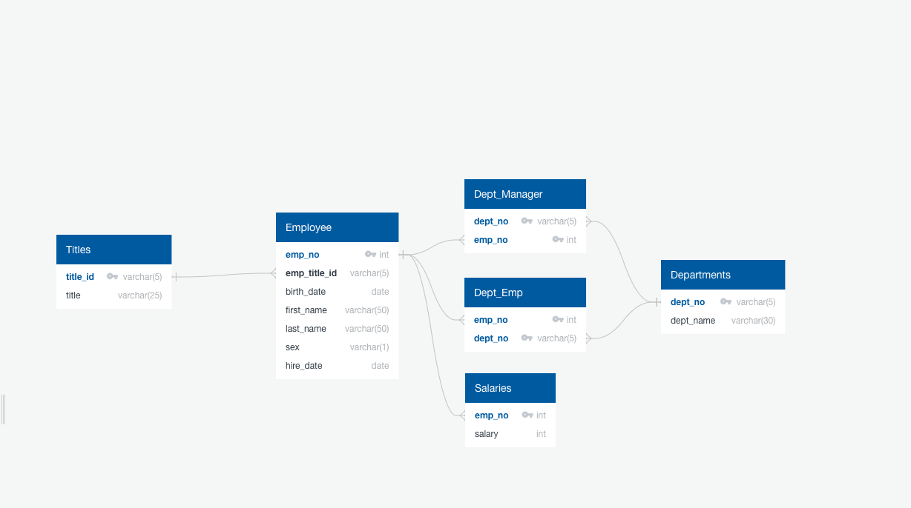

# sql-challenge

## Background

It’s been two weeks since I was hired as a new data engineer at Pewlett Hackard (a fictional company). My first major task is to do a research project about people whom the company employed during the 1980s and 1990s. All that remains of the employee database from that period are six CSV files.

For this project, I’ll design the tables to hold the data from the CSV files, import the CSV files into a SQL database, and then answer questions about the data. I will be using:

* Data Modeling
* Data Engineering
* Data Analysis

## Data Modeling

After I inspected the CSV files, and I have created an Entity Relationship Diagram of the tables using QuickDBD. 



## Data Engineering

I have created a table schema for each of the 6 CSV files with specific data types, primary keys, foreign keys, and constraints.

<details open>
<summary>Create table scripts:</summary>

```sql
CREATE TABLE "Titles" (
    "title_id" varchar(5)   NOT NULL,
    "title" varchar(25)   NOT NULL,
    CONSTRAINT "pk_Titles" PRIMARY KEY (
        "title_id"
     )
);

CREATE TABLE "Employee" (
    "emp_no" int   NOT NULL,
    "emp_title_id" varchar(5)   NOT NULL,
    "birth_date" date   NOT NULL,
    "first_name" varchar(50)   NOT NULL,
    "last_name" varchar(50)   NOT NULL,
    "sex" varchar(1)   NOT NULL,
    "hire_date" date   NOT NULL,
    CONSTRAINT "pk_Employee" PRIMARY KEY (
        "emp_no"
     )
);

CREATE TABLE "Dept_Manager" (
    "dept_no" varchar(5)   NOT NULL,
    "emp_no" int   NOT NULL,
    CONSTRAINT "pk_Dept_Manager" PRIMARY KEY (
        "dept_no","emp_no"
     )
);

CREATE TABLE "Dept_Emp" (
    "emp_no" int   NOT NULL,
    "dept_no" varchar(5)   NOT NULL,
    CONSTRAINT "pk_Dept_Emp" PRIMARY KEY (
        "emp_no","dept_no"
     )
);

CREATE TABLE "Salaries" (
    "emp_no" int   NOT NULL,
    "salary" int   NOT NULL,
    CONSTRAINT "pk_Salaries" PRIMARY KEY (
        "emp_no"
     )
);

CREATE TABLE "Departments" (
    "dept_no" varchar(5)   NOT NULL,
    "dept_name" varchar(30)   NOT NULL,
    CONSTRAINT "pk_Departments" PRIMARY KEY (
        "dept_no"
     )
);
```

<br>
</details>

<details open>
<summary>Add foreign key constraints to the tables:</summary>

```sql
ALTER TABLE "Employee" ADD CONSTRAINT "fk_Employee_emp_title_id" FOREIGN KEY("emp_title_id")
REFERENCES "Titles" ("title_id");

ALTER TABLE "Dept_Manager" ADD CONSTRAINT "fk_Dept_Manager_dept_no" FOREIGN KEY("dept_no")
REFERENCES "Departments" ("dept_no");

ALTER TABLE "Dept_Manager" ADD CONSTRAINT "fk_Dept_Manager_emp_no" FOREIGN KEY("emp_no")
REFERENCES "Employee" ("emp_no");

ALTER TABLE "Dept_Emp" ADD CONSTRAINT "fk_Dept_Emp_emp_no" FOREIGN KEY("emp_no")
REFERENCES "Employee" ("emp_no");

ALTER TABLE "Dept_Emp" ADD CONSTRAINT "fk_Dept_Emp_dept_no" FOREIGN KEY("dept_no")
REFERENCES "Departments" ("dept_no");

ALTER TABLE "Salaries" ADD CONSTRAINT "fk_Salaries_emp_no" FOREIGN KEY("emp_no")
REFERENCES "Employee" ("emp_no");
```

<br>
</details>

## Data Analysis

1. List the employee number, last name, first name, sex, and salary of each employee.

    ```sql
    SELECT public."Employee".emp_no, last_name, first_name, sex, salary
    FROM public."Employee"
    JOIN public."Salaries" ON public."Employee".emp_no = public."Salaries".emp_no;
    ```

2. List the first name, last name, and hire date for the employees who were hired in 1986.

    ```sql
    SELECT first_name, last_name, hire_date 
    FROM public."Employee"
    WHERE hire_date BETWEEN '1986-1-1' and '1986-12-31'
    ORDER BY hire_date ASC;
    ```

3. List the manager of each department along with their department number, department name, employee number, last name, and first name.

    ```sql
    SELECT public."Departments".dept_no, dept_name, public."Employee".emp_no, last_name, first_name
    FROM public."Dept_Manager"
    JOIN public."Employee" ON  public."Dept_Manager".emp_no = public."Employee".emp_no
    JOIN public."Departments" ON public."Dept_Manager".dept_no = public."Departments".dept_no
    ORDER BY dept_name ASC;
    ```

4. List the department number for each employee along with that employee’s employee number, last name, first name, and department name.

    ```sql
    SELECT public."Departments".dept_no,"Employee".emp_no, last_name, first_name, public."Departments".dept_name
    FROM public."Employee" 
    JOIN public."Dept_Emp" ON public."Employee".emp_no = public."Dept_Emp".emp_no
    JOIN public."Departments" ON public."Dept_Emp".dept_no = public."Departments".dept_no
    ORDER BY dept_name ASC;
    ```

5. List first name, last name, and sex of each employee whose first name is Hercules and whose last name begins with the letter B.

    ```sql
    SELECT first_name, last_name, sex
    FROM public."Employee" 
    WHERE first_name = 'Hercules' AND last_name LIKE 'B%'
    ORDER BY last_name ASC;
    ```

6. List each employee in the Sales department, including their employee number, last name, and first name.

    ```sql
    SELECT public."Employee".emp_no, last_name, first_name
    FROM public."Employee" 
    JOIN public."Dept_Emp" ON public."Dept_Emp".emp_no = public."Employee".emp_no
    JOIN public."Departments" ON public."Departments".dept_no = public."Dept_Emp".dept_no
    WHERE dept_name = 'Sales'
    ORDER BY last_name ASC;
    ```

7. List each employee in the Sales and Development departments, including their employee number, last name, first name, and department name.

    ```sql
    SELECT public."Employee".emp_no, last_name, first_name, dept_name
    FROM public."Employee" 
    JOIN public."Dept_Emp" ON public."Dept_Emp".emp_no = public."Employee".emp_no
    JOIN public."Departments" ON public."Departments".dept_no = public."Dept_Emp".dept_no
    WHERE dept_name = 'Sales' OR dept_name = 'Development'
    ORDER BY dept_name ASC;
    ```

8. List the frequency counts, in descending order, of all the employee last names (that is, how many employees share each last name).

    ```sql
    SELECT public."Employee".last_name, COUNT(*) AS freq_count
    FROM public."Employee" 
    GROUP BY last_name
    ORDER BY freq_count DESC;
    ```

## Bonus

Import the SQL database into Pandas and create a visualization of the data:

* Create a visualization of the salary ranges for employees.


